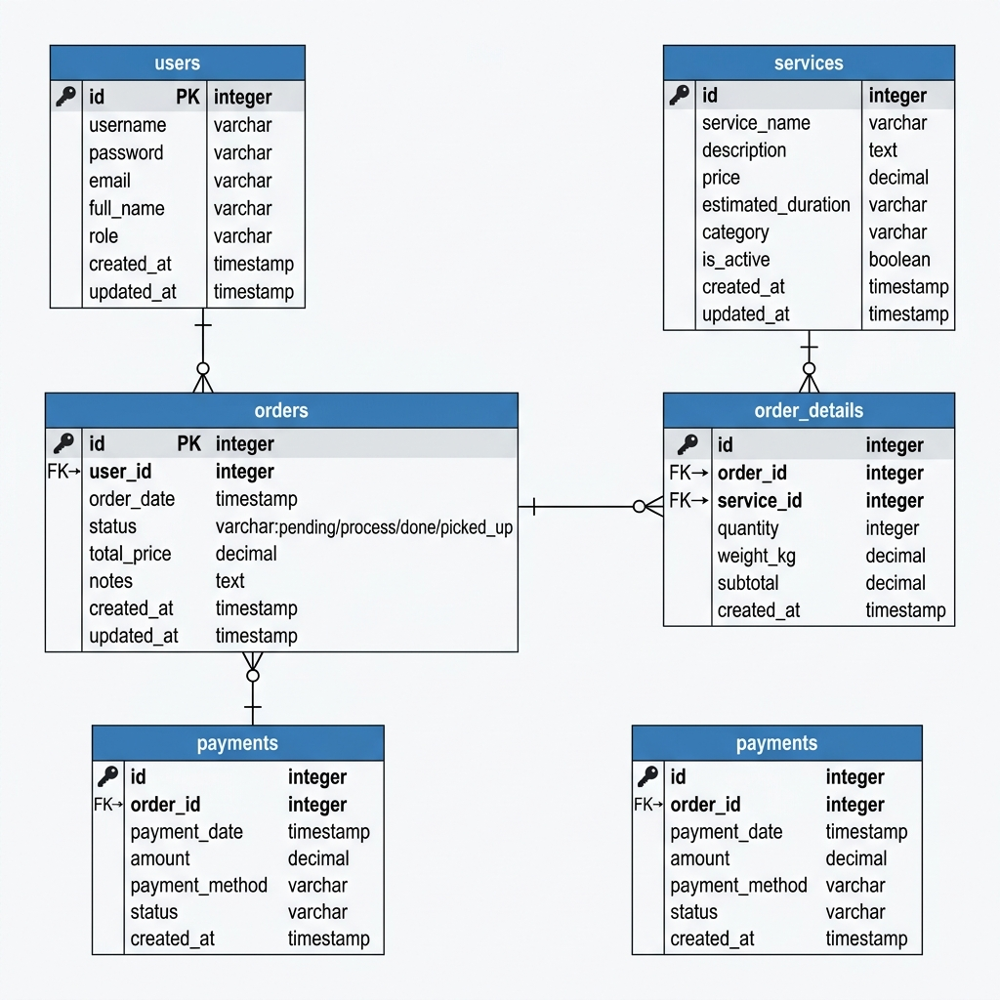

# 🚀 UTS: Pengembangan Aplikasi Web (Refactoring ke MVC)
# KlinPro Laundry - Solusi Cerdas Bisnis Laundry

## 📌 A. Penjelasan Bisnis Startup

### 1. Nama Startup
**KlinPro Laundry**

### 2. Masalah yang Diselesaikan (Problem)
Banyak usaha laundry menengah ke bawah yang masih menangani pencatatan stok kapasitas pencucian mingguan, pelanggan, keuangan, dan pesanan secara manual dengan kertas atau Excel seadanya. Selain itu, manajemen prioritas mesin cuci sering bentrok, menyebabkan waktu penyelesaian tidak sesuai estimasi. KlinPro hadir untuk menyelesaikan masalah manajemen kapasitas dan alur operasi yang berantakan tersebut.

### 3. Target Pengguna
Sasaran dari aplikasi ini adalah untuk bisnis **Laundry Skala Menengah (B2B)** yang memiliki pencucian di atas rata-rata setiap hari. Aplikasi ini digunakan oleh Pemilik (Owner) dan Karyawan/Kasir Laundry.

### 4. Fitur di Dalam Prototipe
Prototipe ini dikembangkan menggunakan **CodeIgniter 4 (MVC)**, berfokus pada sisi Manajerial/Dashboard yang memiliki fitur:
*   **Sistem Autentikasi**: Proteksi session yang aman; pengguna wajib login untuk melihat halaman Dashboard (Role: Admin).
*   **Katalog Layanan (Products Data - Gudang)**: Manajemen variasi layanan (Cuci Reguler, Express, Dry Clean, Perawatan Sepatu, dll.) dengan alokasi stok kapasitas per hari.
*   **Aksi Interaktivitas Bisnis (Front-end JS)**: Implementasi manipulasi DOM untuk Simulasi Penambahan Data Layanan (*Add*), Memproses Pemesanan yang secara *real-time* menurunkan sisa kapasitas/stok (*Update*), serta menghapus layanan (*Delete*) tanpa mereload halaman.

---

## 🛠️ B. Penerapan Arsitektur MVC & OOP (CodeIgniter 4)

Repositori awal ("Spaghetti Code") telah sepenuhnya direstrukturisasi:

*   **Model (`app/Models/ProductModel.php`)**: Berfungsi penuh sebagai *"Gudang"* data yang memanfaatkan konsep OOP. Terdapat metode-metode internal/pembantu seperti fungsi `getCategories()`, penghitung aktif, hingga formatting angka secara mandiri.
*   **View (`app/Views/...`)**: Berfungsi sebagai *"Etalase"* yang mempesona menggunakan framework Bootstrap 5. Tampilan dipisah menjadi modul `login_view.php` dan `dashboard_view.php`.
*   **Controller (`app/Controllers/...`)**: Sebagai *"Manajer"*, memisahkan alur logika untuk `Auth.php` (Session Handling) dan `Dashboard.php` (Pemanggilan data model & Validasi Auth). Termasuk *Dependency Injection* OOP model di _Constructor_ Dashboard Controller.

---

## 🖥️ C. Implementasi UI/UX & Fitur CRUD (Sisi Klien)

Fitur CRUD dirancang menggunakan DOM *Manipulation Vanilla JavaScript*.
1.  **Create**: Form pengisian layanan baru; data secara dinamis disisipkan pada tabel antarmuka.
2.  **Read**: Katalog mengambil data awal secara terstruktur dari `ProductModel`.
3.  **Update**: Aksi "Proses Pesanan" dengan cepat mendeteksi sisa stok/kapasitas harian. Jika diproses, angka akan berkurang dan memberikan penanda visual sukses.
4.  **Delete**: Tombol pendeletan *row* data dan update penghitaman ulang counter layanan.

---

## 🔒 D. Sistem Autentikasi & Session Management

Session ditangani secara utuh melalui CI4 `session()`. Ketika user berhasil masuk dengan autentikasi `admin`/`bisnis123`, flag sesi diset menjadi `isLoggedIn = true`. Perlindungan diletakkan di Index Fungsi Controller Dashboard, memaksa user belum terverifikasi untuk kembali ke form login dengan flash data peringatan.

---

## 📊 2. Perancangan Basis Data (Entity Relationship Diagram)

Sebagai persiapan *Scale-Up*, berikut adalah struktur cetak biru basis data untuk infrastruktur KlinPro masa depan.

*(Silakan lihat file gambar `erd_startup.png` di repositori folder root untuk gambar lengkap)*

Terdapat 5 Entitas beserta hubungan relasinya:
*   `users` (Data pelanggan atau kasir) *1 to Many* ke `orders`.
*   `orders` (Nota pesanan laundry)
*   `services` (List katalog produk)
*   `order_details` (Detail belanja, menghubungkan *1 to Many* dari `orders` & *1 to Many* dari `services`).
*   `payments` (Status Pembayaran finansial, terhubung *1 to 1* ke pesanan).

---

## 📝 LEMBAR JAWABAN

**Nama:** Dzaky Ahnaf
**NIM:** [Isi NIM Anda]

### 1. Profil Startup
*   **Nama Startup:** KlinPro Laundry
*   **Problem yang Diselesaikan:** Susahnya manajemen stok kuota kapasitas pencucian dan track rekod pesanan manual untuk pengusaha laundry harian.
*   **Target Pengguna:** Pengusaha atau Kasir Laundry skala menengah B2B.

### 2. Penjelasan Fitur JavaScript (DOM)
*   **Apa yang Anda buat?**
    1.  **Pengurangan Stok Dinamis**: Saat *"Proses Pesanan"*, program menemukan elemen stok via `closest()` & menurunkannya. Menampilkan perubahan warna dinamis hijau sejenak untuk validasi visual. Saat stok capai 0, state Disable diaktifkan.
    2.  **Penambahan (Append) Tabel Node Baru**: Form tambah membaca nilai *Input*, merangkai format DOM baru via *Template Literal* dan `.appendChild()` di bawah daftar utama. Counters ikut ditambahkan.
    3.  **Penghapusan via Fade Out**: Aksi buang memberikan konfirmasi lalu melenyapkan properti `.remove()` HTML DOM.

### 3. Entity Relationship Diagram (ERD)
*Telah disematkan di dalam markdown file ini, atau lihat lampiran `erd_startup.png` di folder utama.*

### 4. Refleksi Refactoring
*   **Pertanyaan:** Kenapa kita harus memisahkan kode menjadi Model, View, dan Controller (MVC)? Kenapa tidak pakai cara lama seperti di _spaghetti.php_ saja?
*   **Jawaban:** Memisahkan kode menggunakan konsep MVC membantu skalabilitas dan pembacaan instruksi di masa depan. *Spaghetti Code* mencampur HTML dan Query PHP jadi satu file. Jika terjadi _error_ / revisi UI, kita tidak sengaja bisa merusak fungsi Backend/Database. Dengan MVC: Model khusus memegang manipulasi Query SQL/Database. Controller sangat murni mengatur logika IF-ELSE (Kapan memanggil model, kemana mengirim ke View), dan View berfokus 100% pada *design element* dan kenyamanan UI. Pemisahan ini ibarat posisi pekerjaan (Desainer tidak wajib pusing soal alur database Model, programmer DB dapat menulis query mandiri). Skala bisnis akan berkembang jauh lebih stabil dengan fondasi ini.

---
*Task by: KlinPro Devs*
